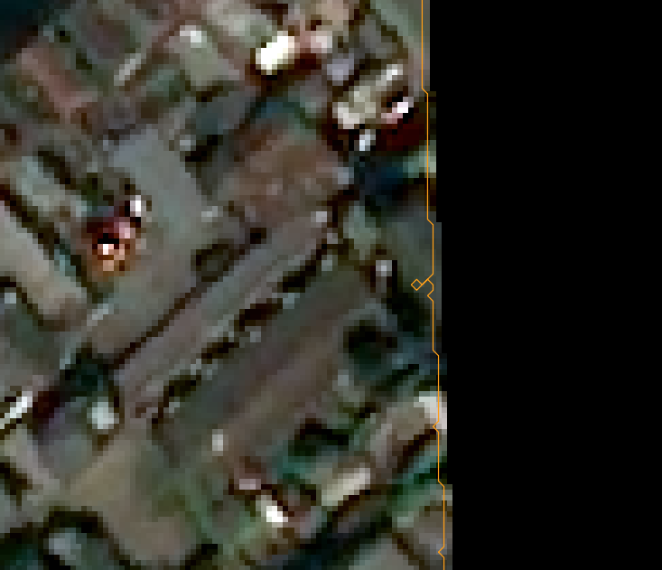

# Raster-Footprint-Extractor
extracts vector polygon of populated data in a raster

method:
1) Iterrate through x & y until a pixel with data is found.
2) Check neighbouring pixels in a clockwise fashion for 3 conditions:
    - Must have 1 or more no data pixel adjacent by a flat side or vertex: \
    \###\
    \#X#\
    \###
    - Must have 1 or more data pixel adjacent by a flat side:\
    o#o\
    \#X#\
    o#o
    - Must not have vistied the pixel before\
    (X = pixel, # = data pixel neighbour, o = no data pixel neighbour)
 3) if the 3 conditons are satisfied move to this pixel and repeat step 2
 4) if neighbours are exhausted and conditions are not met, the footprint has been extracted 

Forewarning: It's slow and there are some odd currently unexplained behavoirs in the path it draws such as:

