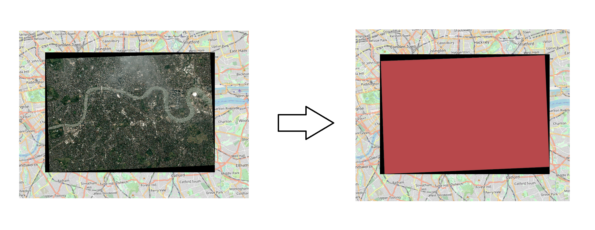

# Raster-Footprint-Extractor
Extracts vector polygon of populated data in a raster using Moore-Neighbor Tracing

Algorithm documented here: http://www.imageprocessingplace.com/downloads_V3/root_downloads/tutorials/contour_tracing_Abeer_George_Ghuneim/moore.html
